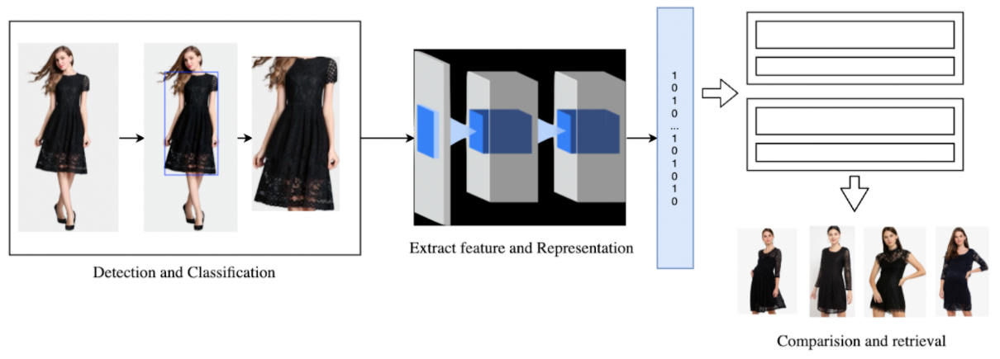

# Tìm kiếm ảnh thời trang

## Introduction


Tìm kiếm hình ảnh thời trang lấy cảm hứng từ việc khách hàng mong muốn khám phá sản phẩm bằng cách thay vì tìm kiếm văn bản mà chuyển sang bằng ảnh của mẫu trang phục tương tự. Hệ thống sử dụng AI để hiểu ngữ cảnh của hình ảnh và trả về danh sách các kết quả liên quan. Hệ thống bao gồm ba thành phần. Đầu tiên, nó phát hiện và phân loại các mặt hàng quần áo trong hình ảnh bằng cách sử dụng Mask R-CNN. Tiếp theo đó, các đặc trưng trong bức ảnh sẽ được rút trích thông qua mô hình RestNet-152. Các đặc trưng này sẽ được lưu trữ trong cơ sở dữ liệu và sử dụng cho mục đích truy vấn hình ảnh. Khi ta đưa vào một bức ảnh sử dụng làm câu truy truy vấn, quần áo trong bức ảnh đó sẽ được nhận dạng, rút trích đặc trưng và so khớp với các đặc trưng trong cơ sở dữ liệu để tìm ra kết quả phù hợp với nhu cầu thông tin của người dùng.

## Requirements

- [Python 3.5+](https://www.python.org/)
- [PyTorch 1.0.0+](https://pytorch.org/)
- [TensorFlow 1.13](https://tensorflow.org/)
- [mmcv](https://github.com/open-mmlab/mmcv)

## File required
Tải và copy thư mục checkpoint vào trong thư mục `.Repo/checkpoints/` tại: [URL](https://drive.google.com/drive/folders/1_E4uHE4yL717teeR1oXEYBDXSlLl7Gjq?usp=sharing)

## Installation

```sh
pip3 install -r requirements.txt
```

## Cấu trúc dữ liệu
Dành cho phần rút trích, ảnh truy vấn sẽ so sánh với các ảnh trong bộ data zalora của Indonesia. Tất cả các ảnh zalora được đặt ở `./static/images/data/` folder. Bộ dữ liệu có cấu trúc như sau:
```sh
.
├── static
│   ├── images 
│   │   ├── data
│   │   │   ├── zalora
│   ... │   ... ├── Atasan
│       ...     │    ├── Product 1 ID
│               │    │   └── Product1_ID.jpg
│               │    ├── Product 2 ID
│               │    │   └── Product2_ID.jpg
│               │    ├── Product 3 ID 
│               │    │   └── Product3_ID.jpg
│               │    ...
│               ├── Blazer
│               ├── Jeans
│               ├── Dress
│               ├── Hoodies
│               ...
│     
...
```
Hệ thống phân cấp dữ liệu như sau:
- Cấp độ đầu tiên là `zalora - tên bộ dữ liệu`
- Cấp độ hai là danh mục sản phẩm. 
- Cấp độ ba là ID sản phẩm có thể xem trong `./static/images/data/zalora/data-zalora.csv` file. 
- Cấp độ bốn là tệp jpg tương ứng.

### Generate Embeddings for Reference Images
Để truy xuất nhanh hơn, tạo ra những bản nhúng cho các ảnh tham chiếu trong bộ dữ liệu như sau:
```sh
python3 ./references/generate_img_list.py
python3 ./references/generate_embeds.py
```

## Run It With
```sh
python3 app-run.py
```

## Video Demo
[Video Demo](.Repo/demo.mov)
